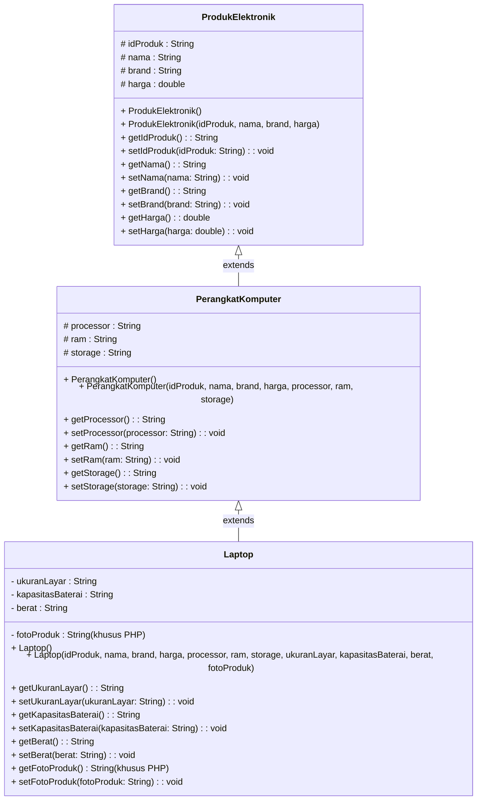
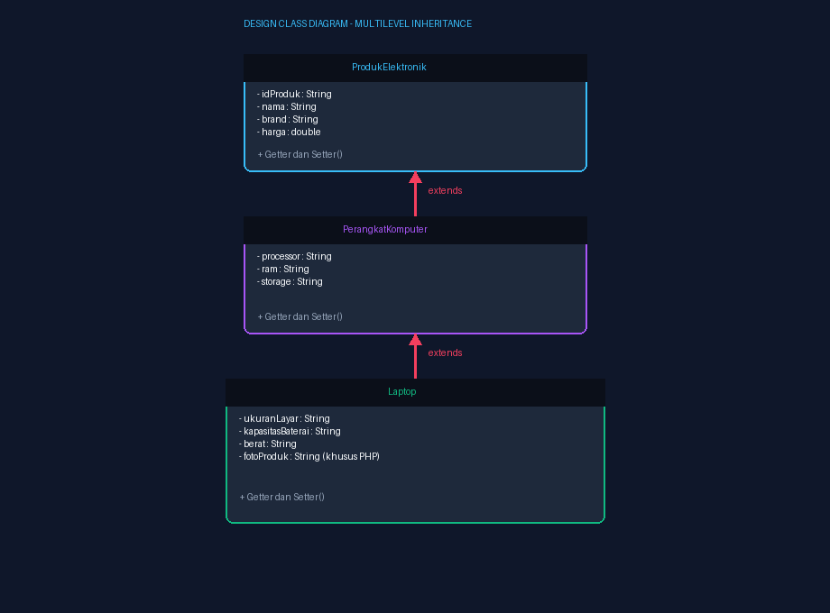
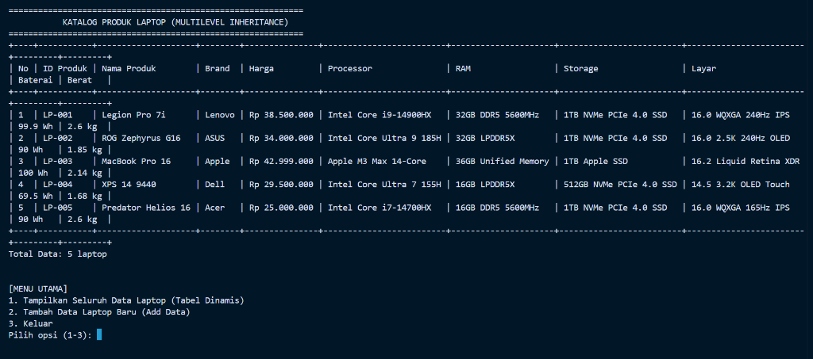
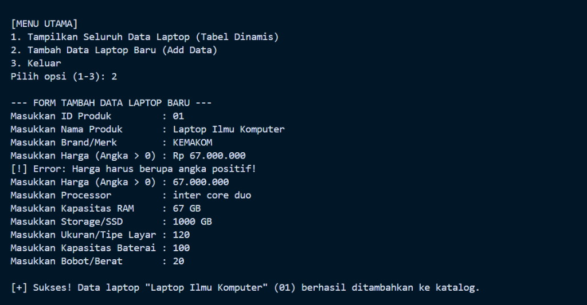
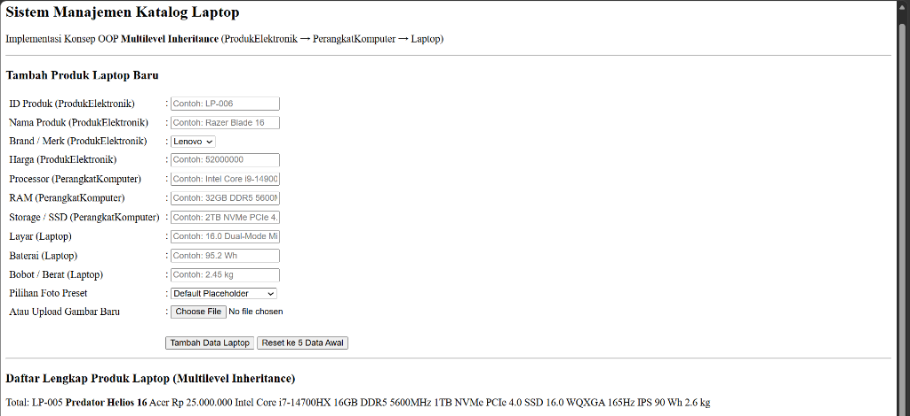

# TP2DPBO2526C1 - TUGAS PRAKTIKUM 2 DPBO INHERITANCE

## ✊🏻 JANJI
> Saya **Najib Nurohman** dengan NIM **[NIM Praktikan]** mengerjakan **Tugas Praktikum 2** dalam mata kuliah **Desain Pemrograman Berorientasi Objek (DPBO)** untuk keberkahan-Nya maka saya tidak akan melakukan kecurangan seperti yang telah dispesifikasikan. Aamiin.

---

## 👾 DESCRIPTION
Program ini mengimplementasikan konsep **Multilevel Inheritance (Pewarisan Berantai)** dalam studi kasus **Katalog Produk Toko Elektronik (Laptop Store)** pada Object-Oriented Programming (OOP).

Hierarki kelas yang dibangun:
1. **`ProdukElektronik`**: *Base Class (Induk Tingkat 1)* yang menyimpan atribut paling umum dari sebuah barang dagang elektronik (ID Produk, Nama, Brand, Harga).
2. **`PerangkatKomputer`**: *Intermediary Class (Turunan Tingkat 1)* yang mewarisi `ProdukElektronik` dan menambahkan atribut spesifikasi komputasi umum (Processor, RAM, Storage).
3. **`Laptop`**: *Derived Class (Turunan Tingkat 2)* yang mewarisi `PerangkatKomputer` dan menambahkan atribut portabilitas khusus laptop (Ukuran Layar, Kapasitas Baterai, Berat, serta atribut `fotoProduk` khusus pada PHP).

Dalam repositori ini terdapat implementasi dalam **4 bahasa pemrograman**:
- 🟦 **C++**
- 🐍 **Python**
- ☕ **Java**
- 🐘 **PHP** (Web interaktif HTML murni, Form Input, dan Foto Produk)

### Ketentuan & Fitur Utama:
- ✅ Memiliki **5 data objek awal default** pada `main` sebelum ada input user.
- ✅ Menerima input dari user untuk **menambahkan data baru (Add Data)**.
- ✅ Menampilkan seluruh data kelas level paling bawah (`Laptop`) **DI DALAM SATU TABEL LENGKAP**.
- ✅ Tabel di lingkungan CLI (C++, Python, Java) bersifat **dinamis** (menghitung panjang maksimum kolom otomatis sehingga border dan teks selalu rapi dan simetris).
- ✅ Pada PHP ditambahkan atribut dan thumbnail visual **`fotoProduk`**.
- ✅ Menyertakan file testcase **`file.txt`** di setiap direktori bahasa.

---

## 💡 ALASAN PEMILIHAN CLASS (DESIGN RATIONALE)
Mengapa struktur Multilevel Inheritance ini dipilih dan masuk akal di dunia nyata (*real-world object mapping*):

1. **`ProdukElektronik` (Level 1 - Base)**:
   Di sebuah toko retail elektronik, semua entitas yang dijual pada dasarnya adalah "Produk Elektronik". Setiap produk elektronik pasti memiliki identitas umum seperti kode SKU/ID produk, nama komersial, pabrikan/brand, dan harga jual.
2. **`PerangkatKomputer` (Level 2 - Intermediary)**:
   Sebuah komputer (baik PC desktop, server, workstation, maupun laptop) adalah produk elektronik (*PerangkatKomputer is-a ProdukElektronik*). Komputer memiliki komponen inti pemrosesan data, yaitu otak pemrosesan (*Processor*), memori kerja (*RAM*), dan media penyimpanan (*Storage*).
3. **`Laptop` (Level 3 - Derived)**:
   Laptop adalah komputer jinjing portabel (*Laptop is-a PerangkatKomputer*). Karena sifatnya yang dirancang portabel dan *all-in-one*, laptop memiliki layar yang terintegrasi (*Ukuran Layar*), sumber daya mandiri (*Kapasitas Baterai*), serta faktor bentuk bobot fisik (*Berat*).

Dengan konsep ini, setiap kelas anak tidak perlu mendeklarasikan ulang properti umum dari kelas induknya, mewujudkan *code reusability*, kerapian enkapsulasi, dan struktur yang modular.

---

## ❌ ERROR HANDLING & VALIDATION
Dalam semua implementasi program (C++, Python, Java, PHP), telah disematkan mekanisme **Error Handling** dan **Input Validation** yang tangguh:

1. **Validasi Keunikan ID Produk (Unique ID Check)**:
   Program akan memeriksa apakah `idProduk` yang dimasukkan user sudah terdaftar di dalam katalog atau belum. Jika ID sudah ada, program akan menampilkan pesan error peringatan duplikasi dan meminta user menginputkan ID baru yang unik.
2. **Validasi Tipe Data dan Nilai Numerik Positif pada Harga**:
   - Jika user memasukkan string/karakter non-angka pada field `harga`, sistem akan menangkap error (*exception / stream fail*) dan meminta input ulang.
   - Jika user memasukkan nilai harga negatif ($\le 0$), program akan menolak dan meminta user memasukkan nilai harga yang valid.
3. **Validasi Input Kosong**:
   Mencegah entri data kosong pada field-field esensial.

---

## 📊 DESIGN DIAGRAM KONSEP (CLASS DIAGRAM)

### Diagram UML (Mermaid)



### Visualisasi Desain Diagram


---

## 📝 DAFTAR ATRIBUT DAN METHODS

| Kelas | Tingkat Hierarki | Atribut | Tipe Data | Keterangan & Methods |
|---|---|---|---|---|
| **`ProdukElektronik`** | Base (Level 1) | `idProduk`<br>`nama`<br>`brand`<br>`harga` | `String`<br>`String`<br>`String`<br>`double` | Constructor (Default & Param), Getter & Setter untuk seluruh atribut induk. |
| **`PerangkatKomputer`** | Intermediary (Level 2) | `processor`<br>`ram`<br>`storage` | `String`<br>`String`<br>`String` | Mewarisi `ProdukElektronik` via `super(...)`, Getter & Setter spesifikasi komputer. |
| **`Laptop`** | Derived (Level 3) | `ukuranLayar`<br>`kapasitasBaterai`<br>`berat`<br>`fotoProduk` *(PHP)* | `String`<br>`String`<br>`String`<br>`String` | Mewarisi `PerangkatKomputer`, Getter & Setter spesifikasi fisik dan gambar laptop. |

---

## 📦 5 DATA AWAL DEFAULT

Sebelum ada aksi input dari user, program menginisialisasi 5 data default:

| No | ID Produk | Nama Produk | Brand | Harga | Processor | RAM | Storage | Layar | Baterai | Berat | Foto (PHP) |
|:--:|---|---|---|---|---|---|---|---|---|---|---|
| **1** | `LP-001` | Legion Pro 7i | Lenovo | Rp 38.500.000 | Intel Core i9-14900HX | 32GB DDR5 5600MHz | 1TB NVMe PCIe 4.0 SSD | 16.0 WQXGA 240Hz IPS | 99.9 Wh | 2.6 kg | `legion_pro_7i.png` |
| **2** | `LP-002` | ROG Zephyrus G16 | ASUS | Rp 34.000.000 | Intel Core Ultra 9 185H | 32GB LPDDR5X | 1TB NVMe PCIe 4.0 SSD | 16.0 2.5K 240Hz OLED | 90 Wh | 1.85 kg | `rog_zephyrus_g16.png` |
| **3** | `LP-003` | MacBook Pro 16 | Apple | Rp 42.999.000 | Apple M3 Max 14-Core | 36GB Unified Memory | 1TB Apple SSD | 16.2 Liquid Retina XDR | 100 Wh | 2.14 kg | `macbook_pro_16.png` |
| **4** | `LP-004` | XPS 14 9440 | Dell | Rp 29.500.000 | Intel Core Ultra 7 155H | 16GB LPDDR5X | 512GB NVMe PCIe 4.0 SSD | 14.5 3.2K OLED Touch | 69.5 Wh | 1.68 kg | `dell_xps_14.png` |
| **5** | `LP-005` | Predator Helios 16 | Acer | Rp 25.000.000 | Intel Core i7-14700HX | 16GB DDR5 5600MHz | 1TB NVMe PCIe 4.0 SSD | 16.0 WQXGA 165Hz IPS | 90 Wh | 2.6 kg | `predator_helios_16.png` |

---

## 📂 STRUKTUR DIREKTORI REPOSITORY

```
TP 2/
├── CPP/
│   ├── ProdukElektronik.hpp
│   ├── ProdukElektronik.cpp
│   ├── PerangkatKomputer.hpp
│   ├── PerangkatKomputer.cpp
│   ├── Laptop.hpp
│   ├── Laptop.cpp
│   ├── Main.cpp
│   └── file.txt
├── Python/
│   ├── ProdukElektronik.py
│   ├── PerangkatKomputer.py
│   ├── Laptop.py
│   ├── main.py
│   └── file.txt
├── Java/
│   ├── ProdukElektronik.java
│   ├── PerangkatKomputer.java
│   ├── Laptop.java
│   ├── Main.java
│   └── file.txt
├── PHP/
│   ├── ProdukElektronik.php
│   ├── PerangkatKomputer.php
│   ├── Laptop.php
│   ├── index.php
│   ├── images/
│   │   ├── legion_pro_7i.png
│   │   ├── rog_zephyrus_g16.png
│   │   ├── macbook_pro_16.png
│   │   ├── dell_xps_14.png
│   │   ├── predator_helios_16.png
│   │   ├── razer_blade_16.png
│   │   ├── msi_titan_18.png
│   │   └── default.png
│   └── file.txt
├── Dokumentasi/
│   ├── class_diagram.png
│   ├── terminal_tampil_data.png
│   ├── terminal_tambah_data.png
│   └── php_demo.png
├── .gitignore
└── README.md
```

---

## 🚀 CARA MENJALANKAN PROGRAM

### 1. C++
```bash
cd CPP
g++ ProdukElektronik.cpp PerangkatKomputer.cpp Laptop.cpp Main.cpp -o main
```
- Menjalankan secara interaktif:
  ```bash
  ./main
  ```
- Menjalankan dengan file testcase:
  ```powershell
  Get-Content file.txt | .\main.exe
  ```

---

### 2. Python
```bash
cd Python
```
- Menjalankan secara interaktif:
  ```bash
  python main.py
  ```
- Menjalankan dengan file testcase:
  ```powershell
  Get-Content file.txt | python main.py
  ```

---

### 3. Java
```bash
cd Java
javac *.java
```
- Menjalankan secara interaktif:
  ```bash
  java Main
  ```
- Menjalankan dengan file testcase:
  ```powershell
  Get-Content file.txt | java Main
  ```

---

### 4. PHP
```bash
cd PHP
php -S localhost:8000
```
Buka browser pada tautan: `http://localhost:8000/index.php`.

---

## 📸 DOKUMENTASI HASIL EKSEKUSI

### 1. 🖥️ Tampilan Katalog Data Awal (Tabel Dinamis CLI)
Menampilkan 5 data laptop default pada tabel dinamis CLI yang rapi dan responsif:


### 2. ➕ Form Tambah Data Baru & Validasi Error Handling (CLI)
Menampilkan proses interaktif penambahan data baru, pengujian validasi harga (*error handling* saat input harga bukan angka positif), dan notifikasi sukses penambahan data:


### 3. 🐘 Antarmuka Pengguna Aplikasi Web (PHP)
Menampilkan halaman web interaktif dengan form penambahan produk dan tabel katalog produk laptop:



